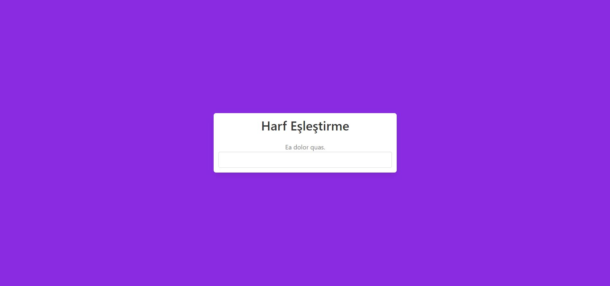
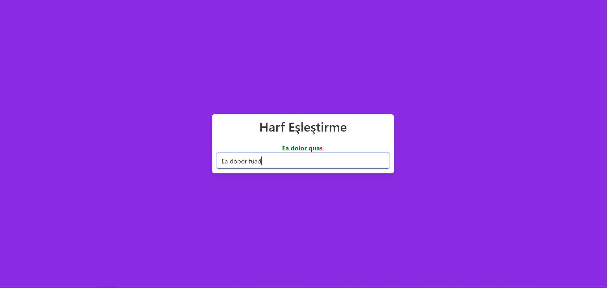
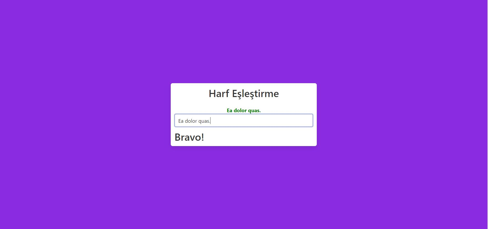

# Angular-Harf-Eslestirme-Projesi
Angular Örnek Projesi Olarak Yaptığım Harf Eşleştirme Projesi
#
- Proje, random üretilen bir cümle ile kullanıcı tarafından girilen cümlenin karşılaştırılmasını baz alıyor.
- Doğru eşleşen her harf yeşil, yanlış eşleşen her harf ise kırmızı rengini alıyor.
- 100% bir eşleşme olduğu anda ise ekrana "Bravo!" yazısı veriliyor.
 
 #
* Proje Angular kullanılarak oluşturuldu.
* Bulma.io kullanılarak görüntü düzenlendi.
* Rastgele cümle oluşturmak için "Faker" kütüphanesi kullanıldı
#

